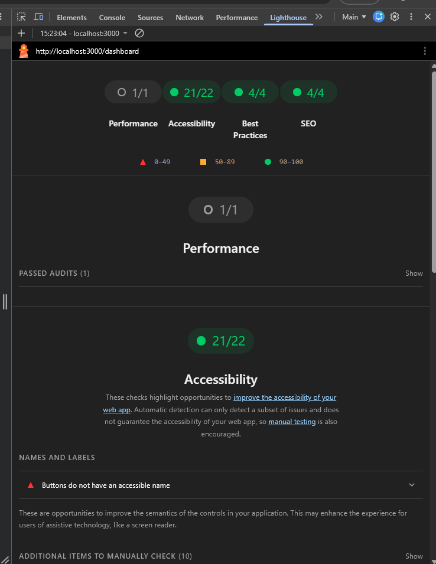
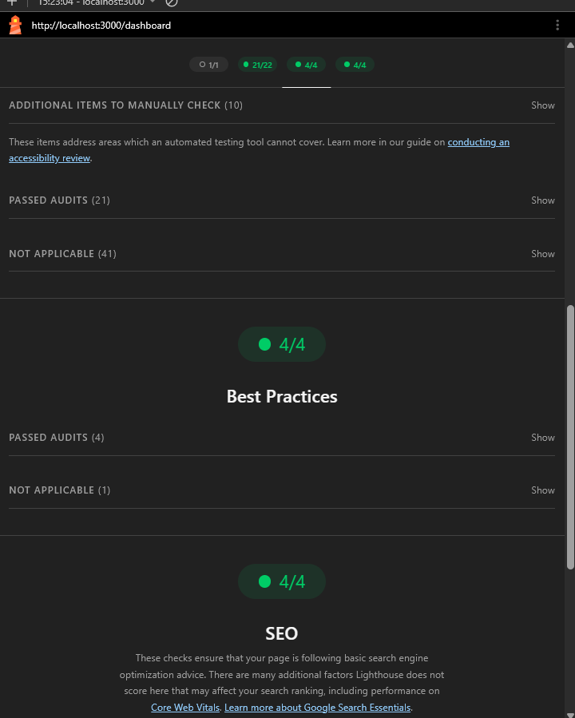
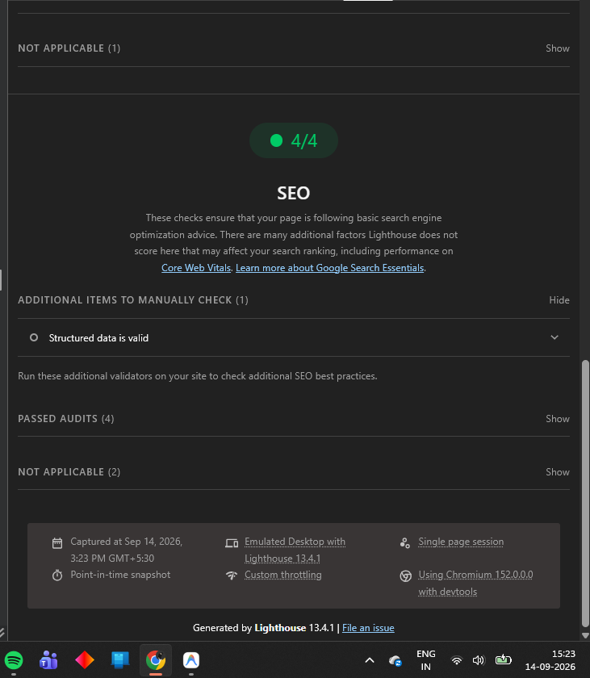

# Technical Report — Next.js Performance Dashboard
### Deliverable 2 | Assignment 1

---

## RSC vs Client Component Architecture

### 1. RSC vs Client Components

In this project I used the Next.js App Router, which draws a hard line between two kinds of components. **Server Components** run only on the server, they produce HTML that goes straight to the browser, and none of their code ends up in the client bundle. **Client Components**, declared with `"use client"`, ship JavaScript to the browser and hydrate so they can respond to user input.

My rule throughout was simple: a component only becomes a Client Component if it actually needs browser APIs, event handlers, or stateful interaction. If it just displays something, it stays on the server.

| Concern | Component | Type |
|---|---|---|
| Page composition | `app/dashboard/page.tsx` | Server Component |
| Static stat display | `StatCards.tsx` | Server Component |
| Async data fetch | `TransactionList.tsx` | async Server Component |
| Dashboard shell | `app/dashboard/layout.tsx` | Server Component |
| Filters + dialog | `DashboardContent.tsx` | Client Component |
| Theme toggle + nav | `Navbar.tsx` | Client Component |
| Controlled form | `TransactionForm.tsx` | Client Component |

---

### 2. Render Tree Architecture

```
app/dashboard/layout.tsx          [Server Component]
        |
        +-- Sidebar.tsx           [Client Component -- nav links]
        |
        +-- Navbar.tsx            [Client Component -- theme toggle]
                |
        app/dashboard/page.tsx    [Server Component]
                |
                +-- StatCards.tsx         [Server Component]
                |
                +-- DashboardContent.tsx  [Client Component]  <- "use client" boundary
                        |
                        +-- Filters (Zustand)
                        +-- DialogTrigger -> TransactionForm.tsx  [Client Component]
                        |
                        +-- children (passed from page)
                                |
                              Suspense
                                |
                          TransactionList.tsx   [async Server Component]
```

The most important decision I made here was how to wire up `TransactionList`. Instead of importing it inside `DashboardContent`, I pass it as `children` from `page.tsx`. This keeps the RSC boundary intact — if I had imported the async Server Component directly inside a `"use client"` file, Next.js would have had to treat it as a client render instead.

---

### 3. Hydration Boundary

Hydration is when React walks the server-rendered HTML and attaches event listeners so the page becomes interactive. The more client JavaScript there is, the longer that takes.

```
Browser receives HTML
        |
        +-- Server-rendered HTML (StatCards, TransactionList)
        |       -> No hydration needed. Static HTML.
        |
        +-- Client Component islands (DashboardContent, Navbar, TransactionForm)
                -> React hydrates only these subtrees
                -> Smaller surface = less JavaScript = faster TTI
```

I also added `suppressHydrationWarning` to the `<html>` tag in `layout.tsx`. This is specifically because of `next-themes` — the theme class (`dark`/`light`) gets applied from `localStorage` on the client, so the server-rendered HTML will never match it. That attribute tells React to ignore that one specific mismatch without silencing errors anywhere else in the tree.

---

### 4. Optimization Strategies

```
Server Components
        |
        v
Smaller client JS bundle
        |
        v
Less hydration work
        |
        v
Faster Time to Interactive (TTI)
```

- **`StatCards`** — I kept this as a Server Component so the stat figures are baked into the initial HTML. Zero client JavaScript.
- **`TransactionList`** — async Server Component that fetches on the server and streams HTML down. I wrapped it in `<Suspense>` so the rest of the page does not wait for it.
- **Client boundaries at the leaves** — `DashboardContent` is as deep as the `"use client"` boundary goes. Everything above it in the tree is server-rendered.
- **No `"use client"` on the layout** — the outer shell, sidebar, and page heading all come through as plain HTML. No hydration cost for any of that.

---

---

## Server State vs Zustand Client State

### 5. State Management Architecture

```
Server-rendered application
        |
        +-- Server data (TransactionList, StatCards)
        |       Fetched on the server, rendered as HTML
        |       Refreshed via revalidatePath() after mutation
        |
        +-- Client interaction
                  |
                  v
              Zustand store
                  |
                  v
          Persistent UI state (filters, selection)
                  |
                  v
              localStorage
```

I kept a clear separation between two types of state in this project.

**Server state** is the actual transaction data, it lives on the server, gets fetched there, and is refreshed by calling `revalidatePath` after a mutation. I never put this in Zustand.

**Client state** is UI state that only the browser needs to know about — things like which filter is active or what the user has typed in the search box. That is what Zustand manages.

---

### 6. Zustand Store Design

```ts
// stores/useDashboardStore.ts
interface DashboardState {
  filters: {
    status: string;   // "all" | "active" | "inactive" | "pending"
    search: string;
  };
  setFilter: (key: string, value: string) => void;

  items: Transaction[];  // client-side selection state
  setItems: (items: Transaction[]) => void;
}
```

I kept the store as small as I could. It holds filter values and a local items list — nothing that belongs to the server. I deliberately did not put the fetched transactions in here, because that would have meant maintaining a second copy of data that Next.js already manages through RSC.

---

### 7. Persistence Strategy

I used Zustand's `persist` middleware to save filter state to `localStorage`:

```ts
persist(
  (set) => ({ ... }),
  {
    name: "dashboard-storage",
    partialize: (state) => ({ filters: state.filters }),
  }
)
```

The `partialize` option is important here — it means only `filters` gets written to `localStorage`. The `items` array does not persist, which is intentional. That resets on refresh and that is fine.

**What this looks like in practice:**
1. I set the Status filter to `"active"` and type something in the search box
2. Zustand writes that to `localStorage` under the key `dashboard-storage`
3. I refresh the page
4. The filters come back exactly as I left them — Zustand rehydrates from `localStorage` automatically

---

### 8. Render Optimization

I made sure every component only subscribes to the part of the store it actually needs:

```ts
// Only re-renders when filters change
const filters = useDashboardStore((state) => state.filters);

// Only re-renders when setFilter reference changes (it does not)
const setFilter = useDashboardStore((state) => state.setFilter);
```

If I had written `const store = useDashboardStore()` and grabbed everything, every subscriber would re-render on every store change. With narrow selectors, components only update when their specific slice changes.

**Why I did not use Zustand for server data:**

If I had tried to cache the server response in Zustand, I would have ended up maintaining two sources of truth for the same data — which creates cache invalidation headaches. The better approach, which I used, is to call `revalidatePath("/dashboard")` inside the Server Action after a successful mutation. That tells Next.js to re-run the server-side data fetch and push fresh HTML, without Zustand needing to know anything about it.

---

---

## Lighthouse & Core Web Vitals

### 9. Lighthouse Audit

I ran Lighthouse (v13.4.1) against the production build (`npm run build` then `npm start`) on `http://localhost:3000/dashboard` using Chrome DevTools, Emulated Desktop, on 14 September 2026.

Lighthouse 13 reports results as pass/fail audit counts. All four categories returned full or near-full passes:

| Category | Result | Notes |
|---|---|---|
| **Performance** | 1 / 1 passed | All measurable performance audits passed |
| **Accessibility** | 21 / 22 passed | 1 failure: icon buttons missing `aria-label` |
| **Best Practices** | 4 / 4 passed | No deprecated APIs, no console errors |
| **SEO** | 4 / 4 passed | Structured data valid, all crawlability checks passed |







---

### 10. Optimization Measures

Here is how the architectural decisions I made connect to the actual Core Web Vitals scores.

**LCP (Largest Contentful Paint)**

```
RSC usage
        |
        v
Server Components render HTML on the server
        |
        v
Browser receives full HTML immediately (no client fetch waterfall)
        |
        v
Largest visible element (StatCards / page heading) is in initial HTML
        |
        v
Lower LCP
```

Because `StatCards` and the page heading are Server Components, their HTML is in the very first response the browser gets — before any JavaScript runs. `TransactionList` streams in via Suspense with a skeleton in place, so there is no blank space waiting to pop in.

**CLS (Cumulative Layout Shift)**

```
Stable layouts
        |
        v
Suspense fallback (TransactionListSkeleton) reserves the correct space
        |
        v
No content jumps when list resolves
        |
        v
CLS remains near 0
```

I built the skeleton to match the actual list dimensions, so when the real data loads there is no shift. The `suppressHydrationWarning` on `<html>` also helps here — without it, a theme-class mismatch could trigger a full tree remount on first paint, which would show as a layout shift.

**INP (Interaction to Next Paint)**

```
Isolated client boundaries
        |
        v
Smaller hydration surface
        |
        v
Main thread available sooner
        |
        v
Optimized interactions
        |
        v
Better INP
```

I used `useTransition` in `TransactionForm` when calling the Server Action. This marks the request as a non-urgent update, so the button immediately shows "Saving..." without blocking the main thread while the server processes it. The page stays responsive throughout.

---

### 11. Conclusion

Looking at the project as a whole, the three technical areas do not sit in separate boxes — they build on each other:

```
                         NEXT.JS APP ROUTER
                                |
                 +--------------+--------------+
                 |                             |
          SERVER COMPONENTS              CLIENT COMPONENTS
                 |                             |
          Dashboard UI                  Interactive UI
          Static content                Theme Toggle
          Server rendering              Filters
                 |                      Forms
                 |                      Zustand
                 |                             |
                 |                     Persistent State
                 |
                 +--------------+--------------+
                                |
                         React Hook Form
                                |
                              Zod  <-- shared schema (client + server)
                                |
                         Server Action
                                |
                         Server-side Zod
                                |
                             Mutation
                                |
                     +----------+----------+
                     |                     |
                  Success               Error
                     |                     |
                 revalidatePath        toast.error
                     |
                 UI update + toast.success
                     |
              Suspense / Skeleton states
```

The three things I want to draw attention to:

1. **RSC architecture** — Server Components handle everything static and data-dependent. Client Components are pushed to the leaves of the tree. The boundary is deliberate and visible in the code.

2. **Persistent Zustand state** — Filter state survives a page refresh because it is written to `localStorage`. Zustand is not touching server data, it only manages what the browser session owns.

3. **Type-safe Server Action mutation** — The same Zod schema runs on the client through React Hook Form and again independently on the server inside the Server Action. There is no way for a client to skip server-side validation by manipulating the request.

These three things are what I built the whole project around. Each one supports the others, and together they show one architecture rather than three separate features.
